# QuickQuirk GameLab — User Guide

QuickQuirk GameLab is a learning app where you work through short lessons, play games to test what you've learned, and earn gold to spend on profile icons. It was designed with learners with ADHD in mind, so every screen is kept simple: one task at a time, large buttons, and obvious text fields.

This guide walks you through everything the app can do.

## Contents

- [Getting started](#getting-started)
  - [Creating an account](#creating-an-account)
  - [Logging in](#logging-in)
- [For learners](#for-learners)
  - [Your main menu](#your-main-menu)
  - [Choosing a course](#choosing-a-course)
  - [Maths](#maths)
  - [English](#english)
  - [Chemistry](#chemistry)
  - [Playing the games](#playing-the-games)
  - [Earning and spending gold](#earning-and-spending-gold)
  - [Editing your profile](#editing-your-profile)
- [For educators](#for-educators)
  - [Creating a classroom](#creating-a-classroom)
  - [Adding learners](#adding-learners)
  - [Viewing a classroom](#viewing-a-classroom)
- [Good to know](#good-to-know)

---

## Getting started

### Creating an account

Signing up takes two short steps.

1. On the login screen, click **Create an Account**.
2. Enter your **full name** and **email**, then click **Continue**.

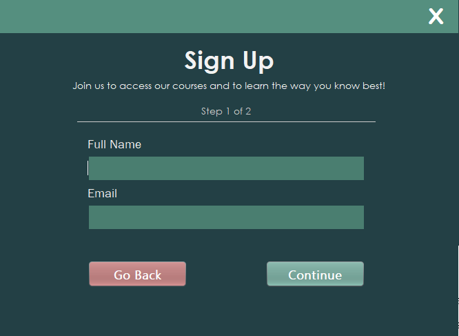

3. Choose a **username** and **password**.
4. Pick your **Learning Role**:
   - **Learner** — to take courses and play games
   - **Educator** — to create classrooms and follow your learners' progress
5. Click **Register**.

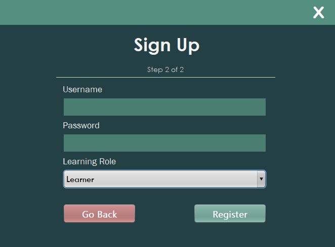

> **Tip:** Your password stays visible while you type it on this screen, so check it before registering. Your username can't be changed later, so choose one you're happy with.

Changed your mind? **Go Back** on either step returns you to the previous screen.

### Logging in

Once you've registered, you're taken back to the login screen with a message confirming your account was created.

1. Type your **username** and **password**.
2. Click **Login**.

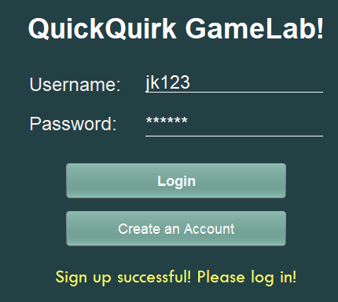

Learners are taken to the learner menu, and educators to the educator menu.

---

## For learners

### Your main menu

Your main menu has two areas.

**The side panel** on the left shows your profile icon, username, full name, and how much gold you have. Its buttons take you to:

- **Edit Profile** — change your details or your icon
- **Access Courses** — browse the lessons
- **Shop** — spend your gold
- **Logout** — at the bottom of the panel

**The main panel** on the right changes to show whichever section you picked.

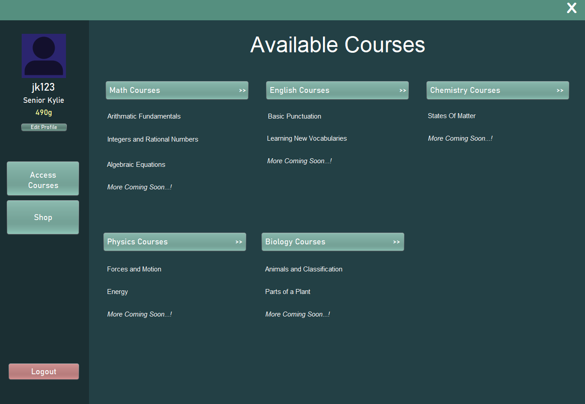

### Choosing a course

Click **Access Courses** to see every subject. Click a subject's button to open it — the topics it covers are listed underneath.

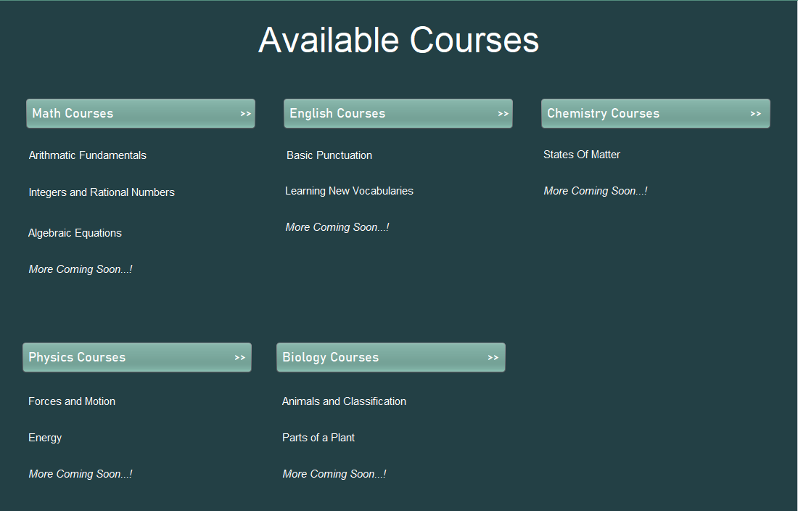

| Subject | Topics |
|---|---|
| Maths | Arithmetic Fundamentals, Integers and Rational Numbers, Algebraic Equations |
| English | Basic Punctuation, Learning New Vocabularies |
| Chemistry | States of Matter |
| Physics | Coming soon |
| Biology | Coming soon |

Physics and Biology are still being built. Clicking them shows a "Course under development" message — click **Okay!** to close it.

**Every course works the same way.** Pick a topic from the sidebar on the left, and its lesson appears on the right. Maths and English also have a **Play Game!** button at the bottom of the sidebar.

### Maths

- **Arithmetic Fundamentals** — adding, subtracting, multiplying, and dividing, shown with coins so you can see what's happening
- **Integers and Rational Numbers** — the different kinds of numbers and how they differ
- **Algebraic Equations** — what equations are and how to solve for a missing value

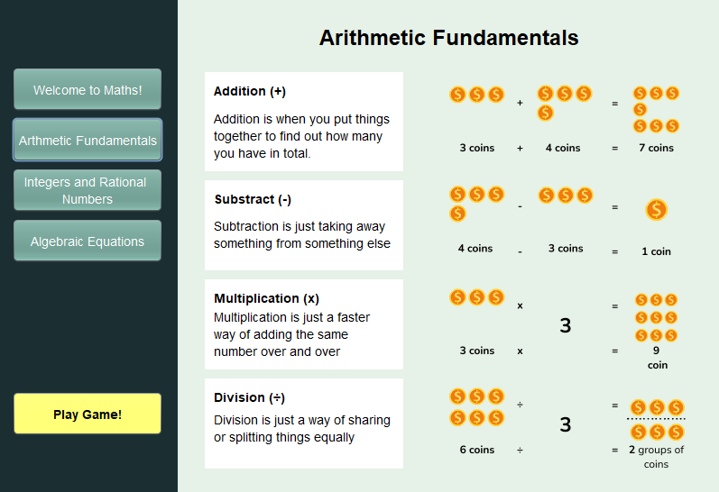

### English

- **Basic Punctuation** — the full stop, comma, question mark, and exclamation mark, each with example sentences
- **Learning New Vocabularies** — works like a set of flash cards. Hover your mouse over a word to flip the card and see what it means.

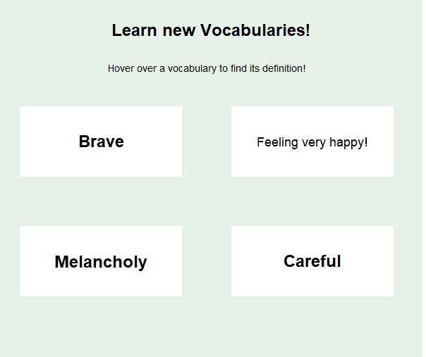

### Chemistry

**States of Matter** is hands-on. You start with a solid, and buttons let you change its state:

| You're looking at | Click | You get |
|---|---|---|
| Solid | Heat (melting) | Liquid |
| Liquid | Heat (evaporating) | Gas |
| Liquid | Cool (freezing) | Solid |
| Gas | Cool (condensing) | Liquid |

Each state comes with its own explanation and a familiar example: ice cubes, water, and steam.

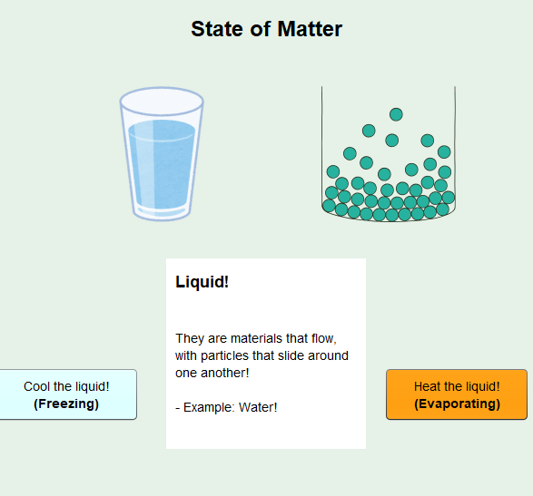

### Playing the games

Maths and English each have a game. Open the course and click **Play Game!** in the sidebar.

Both games follow the same steps:

1. **Instruction page** — read how the game works, then click **Start!**. You can also check the **Leaderboard** first, or **Quit** back to the course.
2. **Answer 10 questions.** Every correct answer adds 100 to your score.
3. **Game End** — see how many you got right and wrong, your final score, and the gold you earned. From here you can **Restart!**, view the **Leaderboard**, or **Quit**.
4. **Leaderboard** — shows the top players and their best scores. **Go Back** returns you to the instruction page.

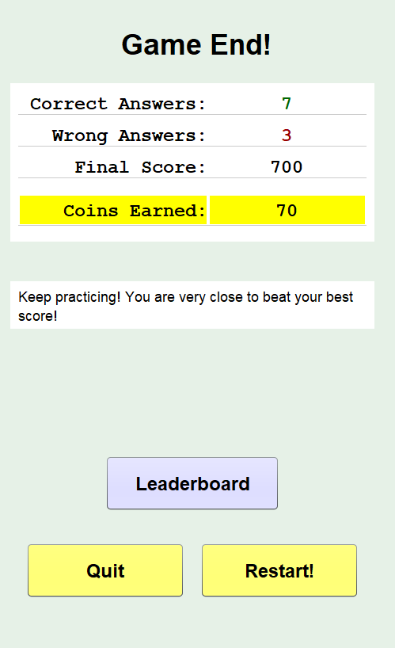
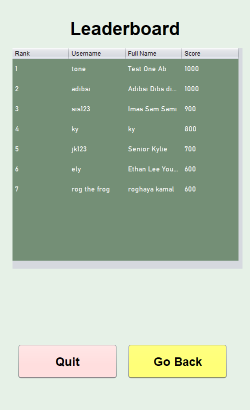

#### Mental Maths

Each question is an algebraic equation, such as `2x + 1 = 3`. Your job is to work out the value of **x**.

- Click the **number buttons** to type your answer, up to two digits
- **Clear** erases what you've typed
- **Enter** submits your answer

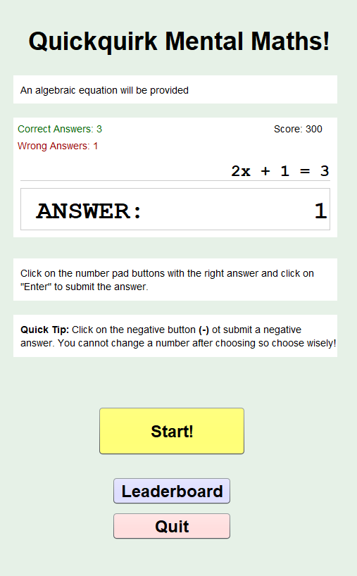
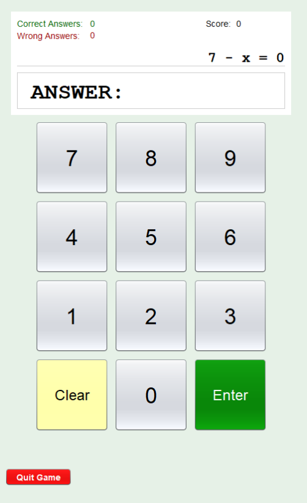

#### Spelling Bee

Each question gives you a definition and a word with its letters jumbled up. Work out the word, type it into the **Answer** box, and press **Enter** on your keyboard.

In the example below, the definition "someone or something you can trust to work well" and the jumbled letters spell **Reliable**.

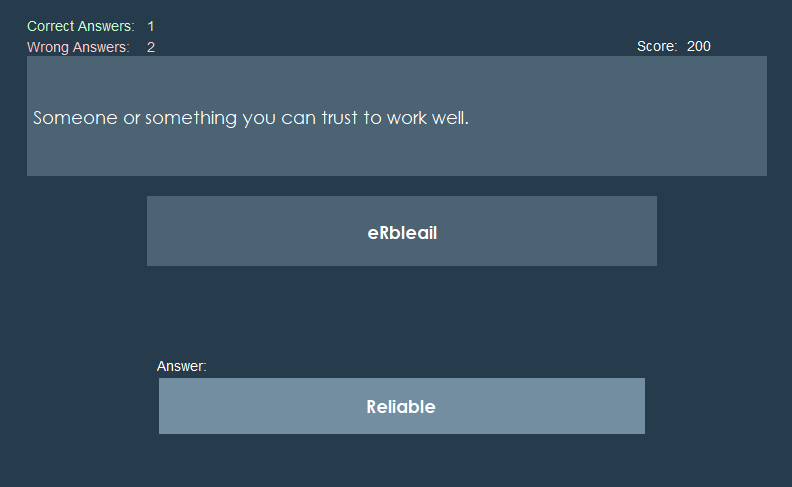

### Earning and spending gold

Every game you finish earns gold, and the better your score, the more you earn. Your balance is shown under your name in the side panel.

To spend it, click **Shop**. Each icon shows its price — click **Buy** underneath to purchase it. You'll need enough gold, and you can't buy the same icon twice.

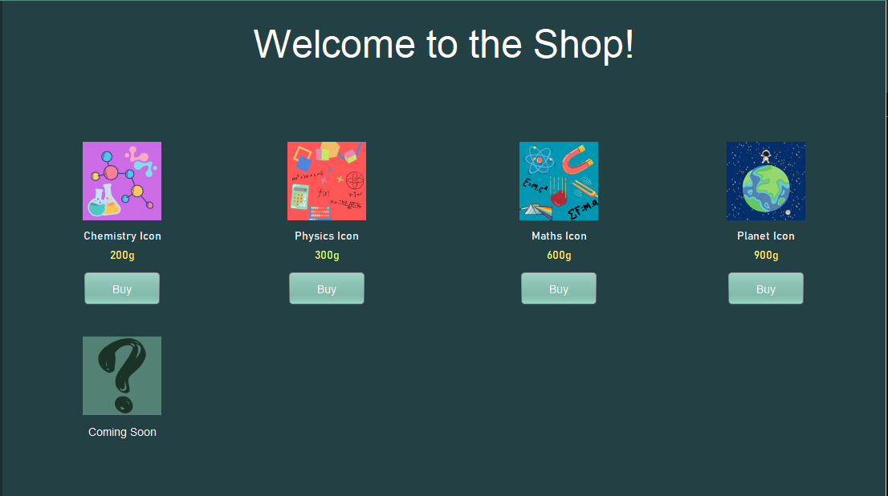

Icons you buy can then be equipped from **Edit Profile**.

### Editing your profile

Click **Edit Profile** in the side panel. There are two tabs on the left:

- **Edit Details** — change your full name, email, or password. Your username is greyed out because it can't be changed.
- **Edit Icon** — click any icon to use it as your profile picture. Icons marked **Locked!** need to be bought from the shop first.

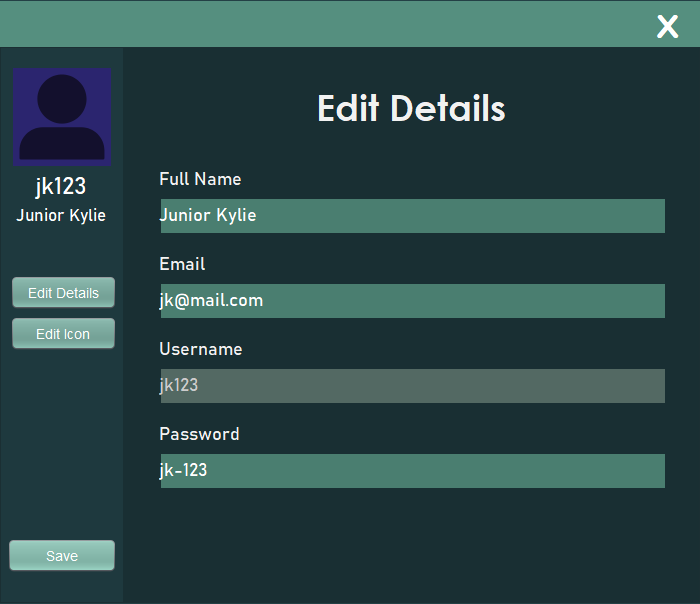
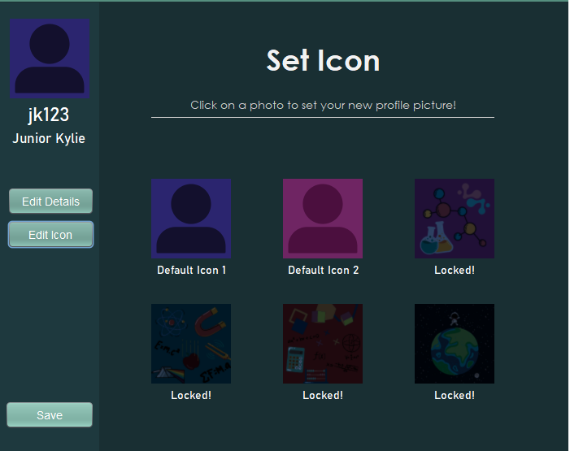

Click **Save** when you're done. You'll see an "Update Successful" message. **Log out and back in** to see your changes.

---

## For educators

After logging in as an educator, your side panel has two options: **Create Classroom** and **View Classrooms**.

### Creating a classroom

1. Click **Create Classroom**.
2. Enter a **Classroom Code** — a short ID such as `Et1` — and a **Classroom Name**.
3. Click **Create Classroom**.

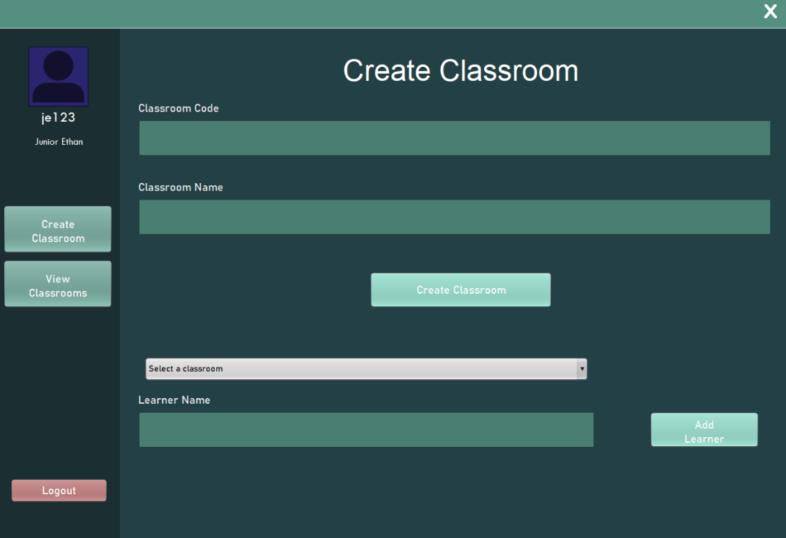

### Adding learners

Use the section below the classroom form:

1. Pick your classroom from the **Select a classroom** dropdown.
2. Type the learner's **username** into the **Learner Name** box.
3. Click **Add Learner**.

A confirmation message appears once the learner has been added.

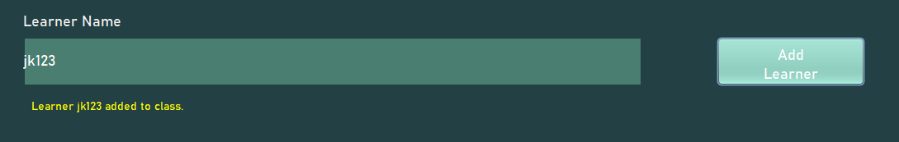

> **Tip:** Despite the box being labelled "Learner Name", it needs the learner's **username**, not their full name.

### Viewing a classroom

1. Click **View Classrooms**.
2. Pick a classroom from the dropdown.
3. Click **View Students**.

You'll see every learner in that class, along with their full name, email, and their best scores in Maths and English.

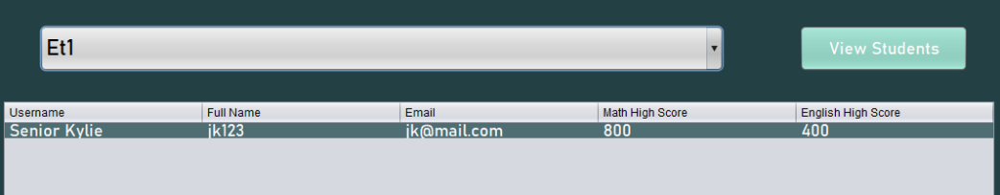

---

## Good to know

- Each game is 10 questions long.
- Leaderboards and classroom lists show each learner's **best** score, not their most recent one.
- Profile changes appear after you log out and back in.
- Usernames are permanent.
- Physics and Biology are coming soon.
- Just trying the app out? Sample learner and educator accounts are listed in the [README](README.md).
